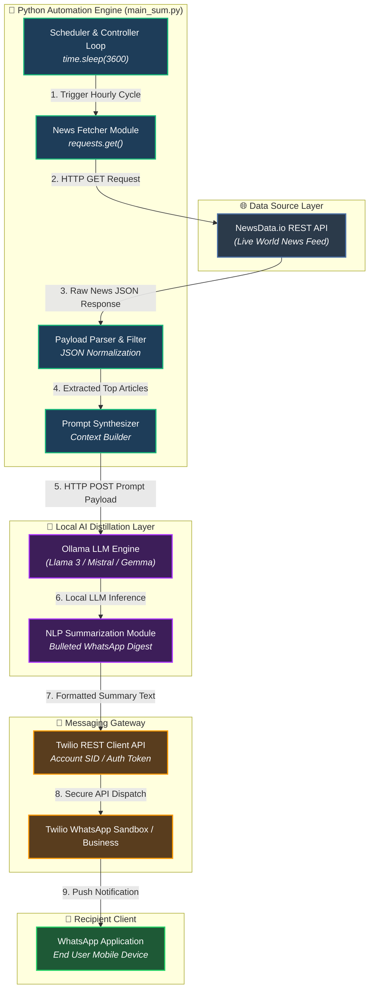
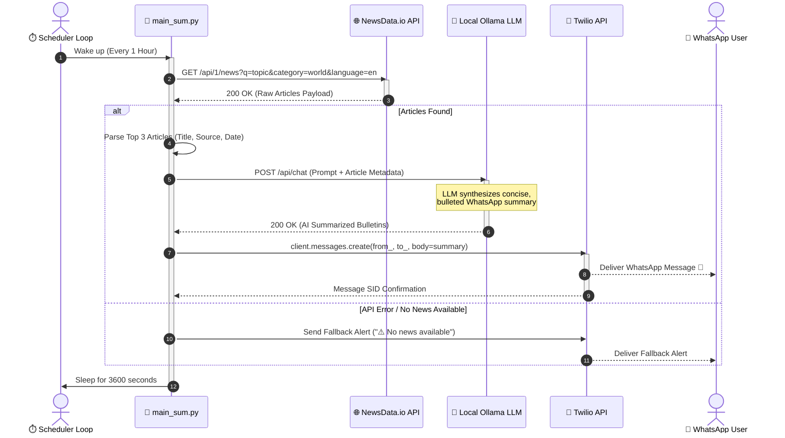

# 📰 AI-Powered WhatsApp News Automation Bot

> **An automated end-to-end news intelligence pipeline that ingests live global news, synthesizes concise AI summaries using a local Ollama LLM, and dispatches real-time updates directly to WhatsApp via the Twilio Messaging Gateway.**

---

[](https://www.python.org/)
[](https://ollama.ai/)
[](https://www.twilio.com/)
[](https://newsdata.io/)
[](LICENSE)

---

## 📌 Executive Summary

The **AI-Powered WhatsApp News Automation Bot** bridges real-time news data ingestion with privacy-first local Large Language Model (LLM) processing and instant mobile notifications. Built with high performance and cost-efficiency in mind, this project demonstrates an autonomous **Extract-Transform-Load (ETL) & AI Distillation pipeline** designed to keep users informed with concise, bulleted news updates delivered to their mobile devices on a configurable schedule.

Unlike traditional news aggregators that flood users with verbose articles, this bot distills complex current events into **WhatsApp-friendly, executive-ready bulletins** without relying on paid third-party LLM APIs—utilizing self-hosted open-weights models through **Ollama**.

---

## 💡 Key Engineering Highlights (Recruiter & Technical View)

* **🤖 Privacy-First Local AI Summarization:** Integrated **Ollama** (Llama 3 / Mistral) via local REST endpoints, ensuring zero per-token cost, high throughput, and strict data privacy.
* **🌐 Automated REST API Ingestion:** Dynamic payload extraction and filtering from **NewsData.io**, handling multi-category, query-filtered, and localized global news feeds.
* **📱 Enterprise Messaging Pipeline:** Reliable delivery channel powered by **Twilio's WhatsApp Business Gateway**, formatted with dynamic WhatsApp Markdown styling (bolding, emojis, structured bullet points).
* **⚡ Resilient & Asynchronous Control Loop:** Continuous polling loop equipped with robust error handling, network timeout resilience, and modular fallback mechanisms.
* **🔒 Secure Configuration Management:** Decoupled secrets management using environment variables via `python-dotenv` for production readiness and cloud readiness.

---

## 🏗️ System Architecture (Block Diagram)

The high-level system architecture illustrates the data flow from external news providers to the end-user's mobile device, highlighting the decoupling between ingestion, AI distillation, and notification dispatching.



---

## 🔄 Project Working Flow (Sequence Diagram)

The sequence diagram below details the operational execution lifecycle during a single automated dispatch cycle.



---

## 📁 Repository Structure

```
news_bot_with_Python_whatsapp/
│
├── 📄 main_sum.py           # Core Production Bot (News Fetching + Ollama LLM Summarization + Twilio)
├── 📄 main.py               # Lightweight Bot (Direct News Forwarding without LLM Summarization)
├── 📄 test.py               # Mock API Response Fixtures & Debugging Script
├── 📄 requirements.txt      # Python Project Dependencies
├── 📄 .env                  # Environment Variables & API Keys (Excluded from Git)
└── 📄 README.md             # Project Documentation & Architecture Blueprint
```

---

## ⚡ Core Technical Components & Modules

### 1. Ingestion Engine (`get_latest_news`)
* Connects to `https://newsdata.io/api/1/news` with parameterized query terms, news categories, and language constraints.
* Incorporates network timeouts (`timeout=10`) and defensive exception handling to prevent runtime stalls.

### 2. AI Summarization Engine (`summarize_news`)
* Constructs targeted prompt templates designed for high-density information extraction.
* Dispatches asynchronous-like JSON payloads to `http://localhost:11434` (Ollama endpoint).
* Configurable model selection (`Llama3`, `Mistral`, `Gemma`, or `Phi3`).

### 3. Dispatch & Gateway Engine (`send_whatsapp_message`)
* Utilizes `twilio.rest.Client` for robust REST API messaging.
* Automatically handles formatting compliance for WhatsApp markdown standards (`*bold*`, `📍 source`, `🕒 timestamp`, `🔗 link`).

---

## 🛠️ Tech Stack & Technologies

| Category | Technology | Usage / Purpose |
| :--- | :--- | :--- |
| **Language** |  | Core Application Logic & Orchestration |
| **Local AI Engine** |  | On-Premise LLM Text Summarization (Zero API cost) |
| **Messaging Gateway** |  | Push Notification Dispatching to WhatsApp |
| **News API** |  | Live Global News Data Source |
| **Networking** | `requests` | HTTP REST API Client Communications |
| **Config & Security** | `python-dotenv` | Environment Variable & Secrets Management |

---

## 🚀 Getting Started & Local Setup

### Prerequisites

1. **Python 3.10+** installed on your system.
2. **Ollama** installed and running locally.
   * Download from [ollama.ai](https://ollama.ai/)
   * Pull your preferred model:
     ```bash
     ollama pull llama3
     ```
3. **Twilio Account** with WhatsApp Sandbox activated.
4. **NewsData.io API Key** (Free tier available at [newsdata.io](https://newsdata.io/)).

---

### Installation Steps

1. **Clone the Repository:**
   ```bash
   git clone https://github.com/your-username/news_bot_with_Python_whatsapp.git
   cd news_bot_with_Python_whatsapp
   ```

2. **Create and Activate Virtual Environment:**
   * **Windows (PowerShell/CMD):**
     ```powershell
     python -m venv venv
     venv\Scripts\activate
     ```
   * **macOS / Linux:**
     ```bash
     python3 -m venv venv
     source venv/bin/activate
     ```

3. **Install Dependencies:**
   ```bash
   pip install -r requirements.txt
   ```

4. **Configure Environment Variables:**
   Create a `.env` file in the root directory:
   ```env
   NEWSDATA_API_KEY=your_newsdata_api_key_here
   TWILIO_SID=your_twilio_account_sid
   TWILIO_AUTH_TOKEN=your_twilio_auth_token
   FROM_WHATSAPP_NUMBER=whatsapp:+14155238886
   TO_WHATSAPP_NUMBER=whatsapp:+91XXXXXXXXXX
   OLLAMA_URL=http://localhost:11434/api/chat
   MODEL_NAME=llama3
   ```

---

### Execution

To run the AI Summarizer Bot:
```bash
python main_sum.py
```

To run the basic (Non-AI) Direct Forwarder Bot:
```bash
python main.py
```

---

## 🌟 Why This Project Stands Out (For HR & Technical Evaluators)

1. **Practical AI Application:** Demonstrates practical usage of **Generative AI / SLMs** in production automation rather than wrapper-only applications.
2. **Cost-Optimized Architecture:** Avoids expensive cloud LLM API costs by leveraging local inference through Ollama.
3. **Clean Code & API Integration:** Exemplifies modular code structure, robust exception handling, and standard REST API consumption patterns.
4. **Real-World Utility:** Directly applicable to executive reporting, real-time crisis monitoring, sentiment tracking, and personalized news digests.

---

## 📄 License

Distributed under the MIT License. See `LICENSE` for details.

---

*Authored with passion for AI Automation & Systems Integration.*
